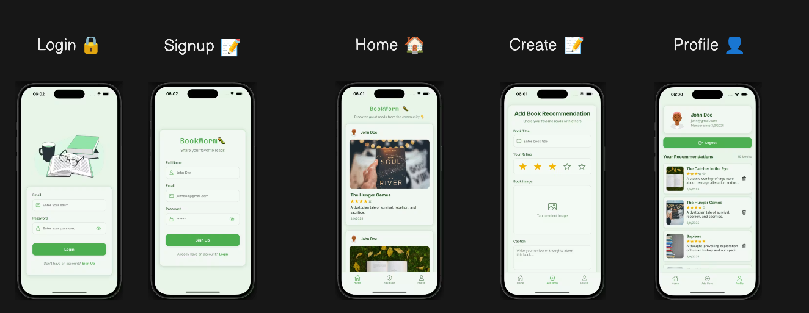

# 📚 Book Store App

A modern **React Native** book recommendation application built with **Expo**. Users can create, browse, and manage book recommendations with secure authentication, image uploads, ratings, and a clean, responsive user interface.

---

## ✨ Features

- 🔐 **Authentication** – Secure sign up, login, and logout with JWT-based authentication.
- 📚 **Book Recommendations** – Create, browse, and manage book recommendations.
- 🖼️ **Image Upload** – Upload and display book cover images.
- ⭐ **Book Ratings** – Rate books using a 5-star rating system.
- 👤 **Profile Screen** – View your profile and all of your published recommendations.
- 🗑️ **Delete Recommendations** – Delete your own recommendations with confirmation alerts.
- 🔄 **Pull to Refresh** – Refresh recommendations with a swipe-down gesture.
- 📱 **Cross-Platform** – Runs on Android, iOS, and Web using Expo.
- ⚡ **Responsive UI** – Optimized list rendering for a smooth user experience.
- 🌐 **REST API Integration** – Connected to a RESTful API for authentication and book management.
- 🔒 **Protected Routes** – Secure access to authenticated screens.
- 🎨 **Modern UI** – Clean and intuitive interface built with React Native.

---

## 🛠️ Tech Stack

- React Native
- Expo
- Expo Router
- Zustand
- JavaScript (ES6+)
- REST API
- JWT Authentication

---

## 🚀 Getting Started

### 1. Clone the repository

### 2. Install dependencies

```bash
npm install
```

### 3. Start the development server

```bash
npx expo start
```

### 4. Run the application

- Press **a** to run on Android.
- Press **i** to run on iOS (macOS only).
- Press **w** to run in your web browser.
- Or scan the QR code using the **Expo Go** app.

---

## 📂 Project Structure

```text
src/
├── app/
├── assets/
├── components/
├── constants/
├── store/
└── utils/
```

---

## 📸 Screenshots


---


This project is intended for learning and portfolio purposes.